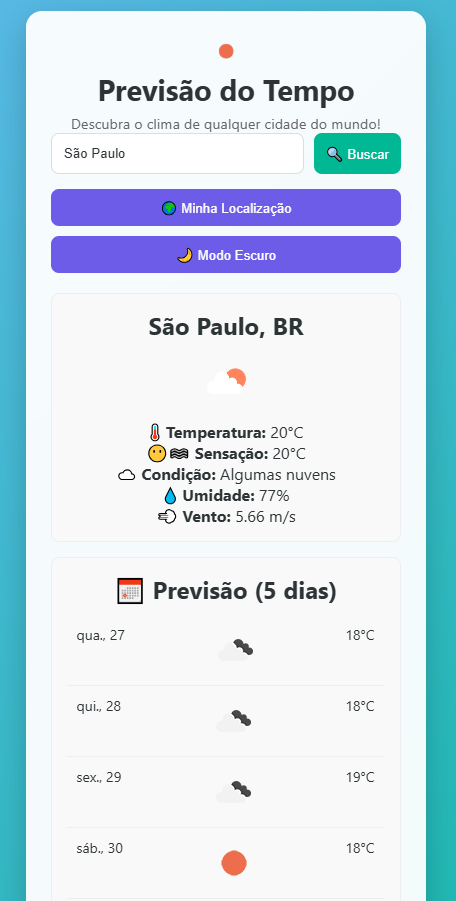

# 🌤️ App de Previsão do Tempo

Um aplicativo simples, bonito e funcional que mostra o clima atual e previsão de 5 dias de qualquer cidade do mundo — feito com **JavaScript puro**!

🚀 [Veja a versão online aqui](https://clima-app-henna.vercel.app)

---

## 🖼️ Imagem do Projeto



---

## ✨ Funcionalidades

- 🔍 Busca por cidade ou estado (ex: "São Paulo", "BA", "Bahia")
- 🌍 Geolocalização automática (mostra clima da sua localização)
- 🌙 Modo escuro / claro com transição suave
- ⭐ Salva cidades favoritas no `localStorage`
- 🌦️ Backgrounds temáticos (mudam conforme o clima: sol, chuva, neve, etc.)
- 📅 Previsão do tempo para os próximos 5 dias
- 📱 Totalmente responsivo (funciona em mobile e desktop)
- 💬 Interface em português do Brasil

---

## 🔧 Tecnologias Utilizadas

- **HTML5** – Estrutura da página
- **CSS3** – Estilos e animações
- **JavaScript (Vanilla)** – Lógica, interações e consumo de API
- **API do OpenWeatherMap** – Dados climáticos em tempo real
- **LocalStorage** – Armazenamento de cidades favoritas
- **Geolocation API** – Detecção da localização do usuário

---

## 🚀 Como Usar

1. Clone o repositório:
   ```bash
   git clone https://github.com/ZhengWortz/clima-app.git