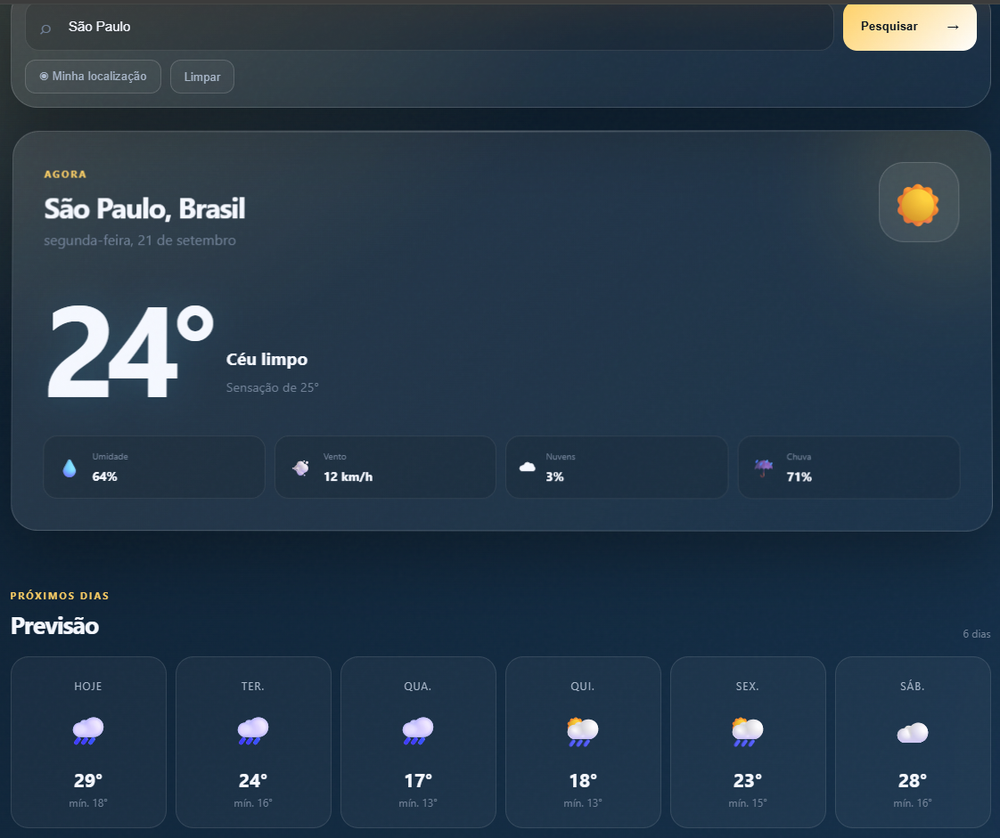
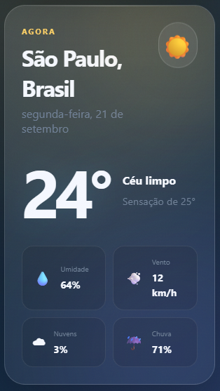

# 🌦️ ClimaVision

> Uma experiência meteorológica imersiva desenvolvida com HTML, CSS e JavaScript.

ClimaVision é uma aplicação web de previsão do tempo desenvolvida com foco em **UI Engineering, Computação Gráfica aplicada à interface e experiência mobile-first**.

O projeto transforma uma aplicação tradicional de consulta meteorológica em uma experiência visual baseada em:

- Glassmorphism
- Glow e iluminação dinâmica
- Microinterações
- Parallax
- Animações
- Backgrounds dinâmicos
- Interface responsiva
- Persistência de favoritos
- Consumo de API meteorológica

---

## ✨ Preview

### Desktop



### Mobile



### 🎬 Demonstração

> Adicione aqui um GIF ou vídeo curto mostrando as animações da interface.

---

# 🚀 Funcionalidades

## 🌎 Consulta meteorológica

O usuário pode pesquisar qualquer cidade através da barra de pesquisa.

A aplicação apresenta:

- Temperatura atual
- Sensação térmica
- Umidade
- Velocidade do vento
- Cobertura de nuvens
- Probabilidade de chuva
- Condição meteorológica

---

## 📅 Previsão

A aplicação apresenta a previsão dos próximos dias através de cards interativos.

Cada card apresenta:

- Dia
- Ícone meteorológico
- Temperatura máxima
- Temperatura mínima

---

## 📍 Geolocalização

O usuário pode utilizar sua localização atual para consultar o clima.

A funcionalidade utiliza a:

```text
Geolocation API